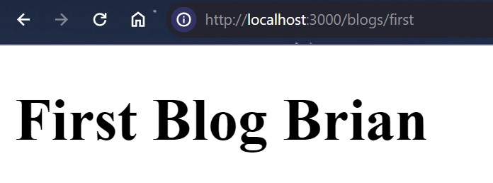
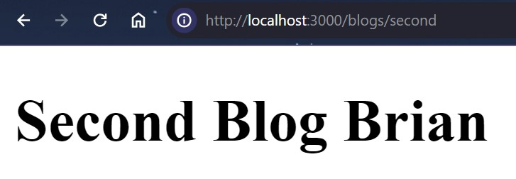

### Nama : Brian Mohamad Safiudin
### NIM : 2141720133
### Kelas : TI-3A
---

# Praktikum 1: Membuat routing bersarang (Nested Routing)

#### Routing di ReactJS dengan NextJS memanfaatkan organisasi penamaan folder dan file pada folder app. Silahkan tambahkan file page.tsx di dalam folder app, dan buatlah komponen dengan kode berikut.

```tsx
export de
fault function Home() {
  return <h1>Welcome to Home Brian</h1> ;
}
```


#### Untuk membuat halaman routing /about dengan NextJS, silahkan buat folder /about dalam /app dan buat file dengan nama page.tsx. Kemudian buat function komponen seperti pada kode berikut.

```tsx
export default function About() {
  return <h1>Welcome to About Brian</h1> ;
}
```


## To-do
#### Buatlah halaman /profile yang menampilkan isi biodata anda dengan menggunakan routing di NextJS.


```tsx
export default function Profile() {
    return (
        <div>
            <h1>Welcome to Profile</h1>
            <p>Nama: Brian</p>
            <p>Email: brianms@gmail.com</p>
            <p>Phone: 082114903130</p>
            <p>Hobby: Coding</p>
        </div>
    )
  }
```


---

# Praktikum 2: Membuat routing sederhana

#### Dengan menggunakan konsep yang sama pada Praktikum 1, silahkan tambahkan susunan folder /blogs/first dan /blogs/second. Kemudian tambahkan masing-masing untuk setiap folder dengan file page.tsx.



## To-do
#### Lengkapi function component pada /blogs/second/page.tsx

```tsx
export default function SecondBlog() {
    return (
          <h1>Second Blog Brian</h1>
    );
  }
  ```


