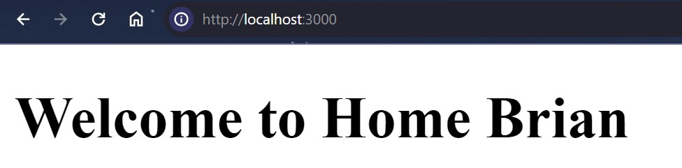
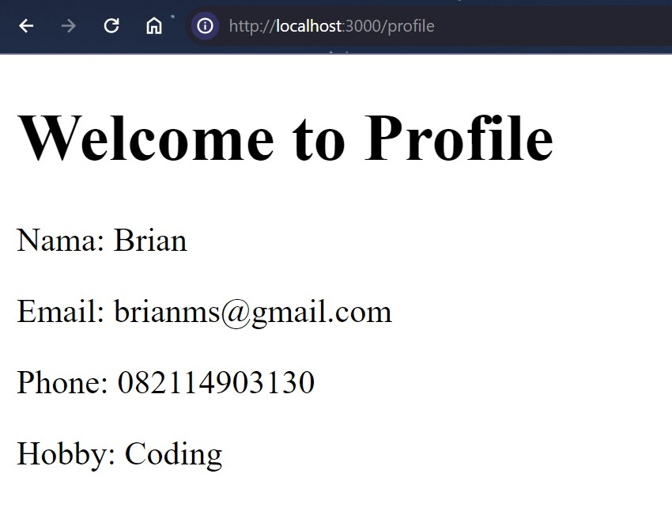

### Nama : Brian Mohamad Safiudin
### NIM : 2141720133
### Kelas : TI-3A
---

# Praktikum 1: Membuat routing bersarang (Nested Routing)

#### Routing di ReactJS dengan NextJS memanfaatkan organisasi penamaan folder dan file pada folder app. Silahkan tambahkan file page.tsx di dalam folder app, dan buatlah komponen dengan kode berikut.

```tsx
export de
fault function Home() {
  return <h1>Welcome to Home Brian</h1> ;
}
```



#### Untuk membuat halaman routing /about dengan NextJS, silahkan buat folder /about dalam /app dan buat file dengan nama page.tsx. Kemudian buat function komponen seperti pada kode berikut.

```tsx
export default function About() {
  return <h1>Welcome to About Brian</h1> ;
}
```


## To-do
#### Buatlah halaman /profile yang menampilkan isi biodata anda dengan menggunakan routing di NextJS.


```tsx
export default function Profile() {
    return (
        <div>
            <h1>Welcome to Profile</h1>
            <p>Nama: Brian</p>
            <p>Email: brianms@gmail.com</p>
            <p>Phone: 082114903130</p>
            <p>Hobby: Coding</p>
        </div>
    )
  }
```



---

# Praktikum 2: Membuat routing sederhana

#### Dengan menggunakan konsep yang sama pada Praktikum 1, silahkan tambahkan susunan folder /blogs/first dan /blogs/second. Kemudian tambahkan masing-masing untuk setiap folder dengan file page.tsx.


## To-do
#### Lengkapi function component pada /blogs/second/page.tsx

```tsx
export default function SecondBlog() {
    return (
          <h1>Second Blog Brian</h1>
    );
  }
  ```


---

# Praktikum 3: Membuat routing dinamis (Dynamic Routing)

#### Anda dapat membuat routing secara dinamis, maksudnya ketika suatu link diakses akan ditambahkan dengan suatu url path yang nilainya dapat berubah secara dinamis. Jadi, dalam praktikum ini akan dibuat susunan URL atau link seperti berikut:

## Link Uutama -> Link dinamis
- /products -> /products/1
- /products -> /products/2
- /products -> /products/3

#### Cobalah akses halaman /products dan /products/1 pada browser anda. Ubah nilai productId dengan nilai lainnya.


## To-do 1
#### Perbaiki implementasi Praktikum 2 menggunakan Dynamic Routes

```tsx
export default function Blog() {
    return (
        <div>
            <h1>Blog Brian</h1>
            <h2>/first</h2>
            <h2>/second</h2>
            <h3>/any (dynamic)</h3>
        </div>
    );
  }
```


## To-do 2
#### Dengan menggunakan konsep Nested Routes dan Dynamic Routes, buatlah halaman dengan routing /products/[productId]/reviews/[reviewId] 


---

# Praktikum 4: Navigasi dengan Link Component

Pada Praktikum sebelumnya Anda telah berhasil membuat routing, tetapi belum dapat menampilkan link navigasi di dalam Project. Untuk melakukan navigasi, anda dapat menggunakan Link komponen yang disediakan oleh library NextJs.

## To-do
#### Tambahkan link yang sebelumnya anda telah kerjakan!

```tsx
export default function Home() {
    return (
        <div>
            <h1>Welcome to Home Brian</h1> 
            <Link href='/profile'>Profile</Link> <br/>
            <Link href='/about'>About</Link> <br/>
            <Link href='/blogs'>Blogs</Link> <br/>
            <Link href='/products'>Products</Link> <br/>
        </div>
    );
  }
```

